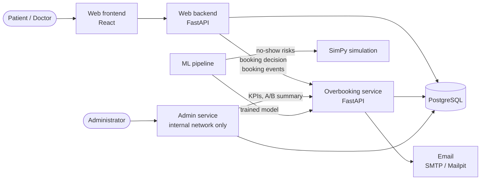

# Outpatient Appointment System: No-Show Prediction and Smart Scheduling

[](https://github.com/cnrasili/noshow-smart-scheduling/actions/workflows/ci.yml)
[](LICENSE)


> An appointment booking system that predicts which patients will miss their appointment, overbooks only where the risk is high, and measures the effect with discrete-event simulation.

Outpatient clinics lose capacity when patients miss their appointments without notice, while overbooking every slot uniformly leads to congestion, long waiting times and physician overtime. This project builds a working appointment booking application in which a machine learning model estimates each patient's no-show probability at booking time. Slots are overbooked selectively, only where the no-show risk is high, and patients receive automated confirmation and reminder messages. The resulting schedules are evaluated with discrete-event simulation to show that both patient waiting time and physician idle time improve compared with fixed-interval booking, and the system reports utilization, idle time and overtime on a separate administration screen.

The project is developed as an interdisciplinary study combining industrial engineering (appointment template design, overbooking policy, simulation) and computer engineering (web application, model-serving API, reminder engine).

## Contents

- [Scope](#scope)
- [Features](#features)
- [Architecture](#architecture)
- [Tech Stack](#tech-stack)
- [Getting Started](#getting-started)
- [Repository Structure](#repository-structure)
- [Development](#development)
- [Dataset](#dataset)
- [Shared Contracts](#shared-contracts)
- [Workflow](#workflow)
- [Project Status](#project-status)
- [Course](#course)
- [License](#license)
- [References](#references)

## Scope

- The analysis starts with one outpatient clinic session of one physician with fixed-length appointment slots. Later stages extend it to several physicians and departments, including several physicians of the same department.
- The demo application contains several physicians in several departments.
- The prediction model is trained on the public Medical Appointment No Shows dataset; the application and the simulation use simulated data. The dataset has no physician or department information, so physicians and departments in the simulation are assumed.
- Selective overbooking is compared with fixed-interval booking.
- Real patient data and integration with hospital information systems are outside the scope.

## Features

| Area | What it does |
|---|---|
| **Booking application** | Patients choose department → doctor → day → time and manage their appointments. Doctors see their daily patient list, record attendance and open slots from their working hours. Patients log in with their national ID number, doctors with their email address; accounts are created by the hospital, there is no registration. |
| **No-show prediction** | Each booking is scored with the patient's no-show probability, computed only from information known at booking time. |
| **Selective overbooking** | A booked slot accepts an extra patient only when every booked patient is likely to miss the appointment, within the slot capacity and a daily limit. Every decision is logged with its reason. |
| **Confirmation and reminders** | A confirmation is sent at booking and a reminder before the appointment; cancelled appointments stop their reminders. |
| **Reminder A/B test** | Patients are split into reminder and control groups; the no-show rates of the groups are compared with a two-proportion z-test. |
| **Admin service** | Separate administration screen reachable only from the internal network, with its own administrator accounts, login protection and audit log. Creates patient and doctor accounts. Shows utilization, physician idle time, overtime, mean waiting time and overbooked slots per doctor and day, and the reminder A/B test. |
| **Simulation** | SimPy model of a clinic session that compares fixed-interval booking, overbooking rules and appointment templates on real appointment days. |
| **Model reports** | Data cleaning, logistic regression and random forest, AUC and calibration reports. |

## Architecture



The web backend asks the overbooking service before every booking. The service computes the features, scores the patient with the model, applies the overbooking rule and schedules the messages. The admin service is a separate application for the hospital administration; it reads the KPIs from the overbooking service and is not reachable from the public website. All services share one PostgreSQL database with a single Alembic migration history.

## Tech Stack

| Layer | Technology |
|---|---|
| Web frontend | React 19, React Router, TypeScript, Vite |
| Web backend | FastAPI, Pydantic |
| Overbooking service | FastAPI, Pydantic, APScheduler, scikit-learn, joblib |
| Admin service | FastAPI, Jinja2, Chart.js |
| Database | PostgreSQL 16, SQLAlchemy 2, Alembic |
| Email | SMTP; Mailpit in development |
| Prediction model | Python, pandas, scikit-learn, Jupyter |
| Simulation | Python, SimPy |
| Infrastructure | Docker Compose, GitHub Actions |
| Code quality | ruff, pytest, oxlint, Prettier |

## Getting Started

Requirements: Docker Desktop.

```bash
git clone https://github.com/cnrasili/noshow-smart-scheduling.git
cd noshow-smart-scheduling
docker compose up --build -d
docker compose exec web-backend python -m web_backend.seed
docker compose exec overbooking-service python -m overbooking_service.demo
docker compose exec admin-service python -m admin_service.create_admin --email admin@hospital.local
```

The seed creates a fictional clinic with doctors, patients, login accounts and slots; demo patients have fictional national ID numbers, and the demo accounts are listed in the [web backend README](web/backend/README.md#demo-data). The overbooking service demo adds three weeks of booking history with outcomes and A/B groups for the KPI screen; see the [demo scenario](overbooking-service/README.md#demo-scenario). The last command creates an administrator of the admin service and asks for a password.

| Service | URL |
|---|---|
| Web application | http://localhost:5173 |
| Web backend API docs | http://localhost:8000/docs |
| Overbooking service API docs | http://localhost:8001/docs |
| Admin service (KPI screen) | http://localhost:8002 |
| Mailpit (sent emails) | http://localhost:8025 |
| PostgreSQL | `localhost:5432` |

Only the website (web application and web backend) is reachable from other machines; the overbooking service, the admin service, Mailpit and PostgreSQL are published on `127.0.0.1` only.

Default settings work without configuration. To change them, copy `.env.example` to `.env`.

<details>
<summary><b>Troubleshooting</b></summary>

| Problem | Solution |
|---|---|
| `error during connect` or `cannot find the file specified` | Start Docker Desktop and wait until it is running. |
| `port is already allocated` | Copy `.env.example` to `.env` and change the port of that service, for example `DB_PORT=5433`. |
| Code changes are not picked up | File watching uses polling in Docker; wait a few seconds or restart the service with `docker compose restart <service>`. |
| Database schema is out of date | Run `docker compose up --build migrate`. |
| Start from a clean database | Run `docker compose down -v`. This deletes all local data. |

</details>

## Repository Structure

| Folder | Content |
|---|---|
| [`web/frontend/`](web/frontend/) | Patient and doctor interfaces |
| [`web/backend/`](web/backend/) | Booking API, login, slot generation, demo data |
| [`overbooking-service/`](overbooking-service/) | Model-serving REST API, overbooking rule engine, reminder jobs, A/B logging, KPI calculation |
| [`admin-service/`](admin-service/) | Administration screen: administrator login, KPI screen, audit log |
| [`db/`](db/) | Shared SQLAlchemy models and Alembic migrations |
| [`ml/`](ml/) | Data preparation, no-show prediction model (logistic regression / random forest), AUC and calibration |
| [`simulation/`](simulation/) | Appointment templates, overbooking policies, SimPy discrete-event simulation |
| [`docs/`](docs/) | Shared contracts between components: API, model features, KPI definitions |

Each folder has its own README with setup and usage details.

## Development

Each component can also be run without Docker; see its README. The checks that CI runs:

```bash
ruff check .
ruff format --check .
pytest web/backend overbooking-service admin-service
cd web/frontend && npm run lint && npm run format:check && npm test && npm run build
```

Tests that need PostgreSQL run only when `NOSHOW_TEST_DATABASE_URL` points to a disposable database (see the [web backend README](web/backend/README.md)).

## Dataset

The prediction model is trained on the public [Medical Appointment No Shows](https://www.kaggle.com/datasets/joniarroba/noshowappointments) dataset (Hoppen, 2016), which contains about 110,000 appointments from public clinics in Vitória, Brazil.

The dataset is **not** stored in this repository. To use it:

1. Download the dataset from Kaggle.
2. Place the CSV file in `ml/data/raw/`.

The dataset is licensed under [CC BY-NC-SA 4.0](https://creativecommons.org/licenses/by-nc-sa/4.0/) by its author and is used for non-commercial academic purposes only.

## Shared Contracts

Components depend on each other through the files below. Changes to them are agreed by all components involved.

| Document | Between |
|---|---|
| [API contract](docs/api-contract.md) | Web backend, overbooking service and admin service, including the shared database tables |
| [Model features](docs/features.md) | Prediction model, overbooking service and web backend |
| [Model export](ml/export_model.py) | Prediction model and overbooking service |
| [KPI definitions](docs/kpi-definitions.md) | Simulation and KPI screen |

## Workflow

- `main` always contains working code and is updated only by the maintainer through reviewed pull requests.
- Each contributor works on one branch and keeps it up to date with `main` (`git merge origin/main`). Older branches of the same contributor are removed automatically by the `Branch cleanup` workflow; unmerged work is kept as an `archive/...` tag.
- Pull requests reference the issue they solve (`Closes #<number>`); open work is tracked in [GitHub Issues](https://github.com/cnrasili/noshow-smart-scheduling/issues).
- Each issue has one assignee and covers one component; its Scope section lists the files it may change. Work needed in another component is requested in a comment, not made in the same pull request.
- Commit messages are one line in the form `type: Imperative short message`, for example `feat: Add prediction endpoint` or `fix: Correct lead time calculation`.
- Database changes go through Alembic migrations in [`db/`](db/).
- Never commit secrets or the dataset. Copy `.env.example` to `.env` and fill in local values.

## Project Status

| Component | Status |
|---|---|
| Booking application | Working: login, booking, cancellation, doctor views, attendance |
| Overbooking service | Working: prediction, overbooking decision, messages, A/B test, KPIs |
| Admin service | Working: administrator login, internal network restriction, KPI screen, account management, audit log |
| Prediction model | Trained; the service still uses a placeholder model until the trained model is delivered |
| Overbooking rule | Default threshold; the final rule and threshold come from the simulation study |
| Simulation | Single session, appointment templates and real appointment days; extension to several physicians and departments planned |

## Course

LMMF405 Interdisciplinary Project, Fall 2026–2027, Department of Industrial Engineering (Eng), Istanbul Arel University.

## License

The source code is released under the [MIT License](LICENSE). The dataset is subject to its own license (see [Dataset](#dataset)).

## References

Hoppen, J. (2016). *Medical appointment no shows* [Data set]. Kaggle. https://www.kaggle.com/datasets/joniarroba/noshowappointments
